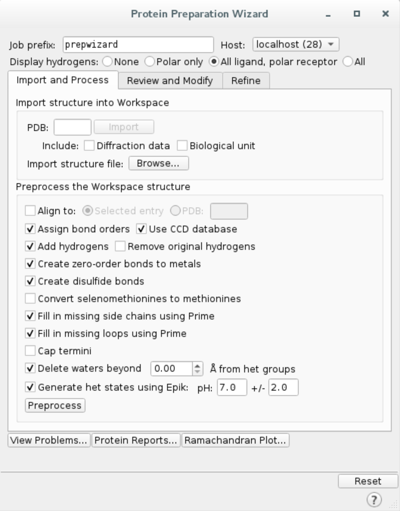

GPCR tutorial
=================================================

In this tutorial we will run the GPCR simulation of μ-opioid receptor which aims to find the path of BU72 agonist (PDB code 5C1M)
to the orthosteric site.

Initially, the software with randomise the position of the ligand around the specified initial site, then perform a simulation
slightly biased against the solvent accessible surface area. The setup will automatically constrain α-carbons to prevent the collapse of
the initial structure due to the lack of membrane as well as set up a simulation box encompassing both the initial and the orthosteric site.

1. Protein preparation
+++++++++++++++++++++++

We will import the complex from Protein Data Bank and preprocess it using Schrödinger Maestro (release 2020-1).

a. Launch Maestro and **import the structure from PDB** by clicking ``File -> Get PDB...``, type in your PDB ID, e.g. ``5C1M``,
and click ``Download``. The protein structure should appear in your workspace.

.. image:: ../img/gpcr_tutorial_1a.png
  :width: 400
  :align: center

b. Remove the redundant nanobody from the structure. Click on ``Select -> Set pick level -> Chains``, then select chain B in the workspace. Open ``Build`` window and remove
selected atoms. You should also remove any other irrelevant residues, such as OLC, CLR and P6G. This way we will be left with the receptor structure only.

c. **Preprocess the protein** using Protein Preparation Wizard. Click on ``Tasks`` and search ``Protein Preparation Wizard``.
Check the following options and hit ``Preprocess``.
    - Fill in missing side chain using Prime*
    - Fill in missing loops using Prime*
    - Delete waters beyond 0.0 Å from het groups (i.e. all waters in the system)

\*If you do not have Prime license, you can skip those steps.

The preprocessing might take a few minutes. Maestro will warn you about three residues with double occupancy issues. Simply select them all, click ``Commit`` and then
``Update`` to ensure there are no more problems with the protein. Upon completion, you should see ``5C1M - preprocessed`` on the entry list.

d. **Change ligand chain ID and residue name**
    - Click on ``Select -> Set pick level -> Residues``, then select ligand ``4VO`` (residue 401) with a mouse click
    - Open ``Build`` and choose ``Other edits -> Change atom properties...``
    - Set residue name to ``LIG`` and chain name to ``Z``
    - Choose ``PDB atom name`` from the drop down list and select ``Set unique PDB atom names within residues``
    - Click ``Apply`` and close the window

e. **Pick atom** to track progress. One of the metrics we use to follow the simulation is the distance between two
selected atoms. In this case, we will pick ligand atom ``Z:401:C13`` and then track its distance to the orthosteric site.

f. **Export structure** by clicking on ``File -> Export structures...`` and save all workspace atoms as ``complex.pdb``
in your working directory. You can close Maestro now.

2. PELE input file
++++++++++++++++++++

Create ``input.yaml`` file in your working directory, it should contain the following flags:

    - **system** - path to the protein-ligand PDB file
    - **chain** - ligand chain ID, here ``Z``
    - **resname** - ligand residue name, in our case ``LIG``
    - **gpcr_orth** - sets the defaults for the GPCR simulation
    - **orthosteric_site** - atom in the orthosteric site
    - **initial_site** - atom in the initial site
    - **atom_dist** - atoms used to track the progress of the simulation, we will use one from the ligand and one from the receptor, following ``chain ID:residue number:atom name`` format
    - **cpus** - number of CPUs you want to use for the simulation (we suggest a minimum of 50 for a normal simulation, but you could lower it for training purposes only)
    - **seed** - random seed to ensure reproducibility.

..  code-block:: yaml

    system: 'complex.pdb'
    chain: 'Z'
    resname: 'LIG'
    gpcr_orth: true
    initial_site: "A:303:N" # Lys303 nitrogen
    orthosteric_site: "A:147:CG" # Asp147 interacting with the ligand gamma-carbon
    seed: 12345
    cpus: 50
    atom_dist:
    - "A:147:CG"
    - "Z:401:C13"

3. Launching the simulation
+++++++++++++++++++++++++++++

Once you have ``complex.pdb`` and ``input.yaml`` in your working directory, you can launch the simulation using one of the following methods:

    - **directly** on command line using ``python -m pele_platform.main input.yaml``

    - submit a slurm file to the **queue system** (ask your IT manager, if you are not sure how to do it). In our case, the slurm file is called ``run.sl`` and we can launch it on the command line using ``sbatch slurm.sl``

Example slurm file:

.. code-block:: console

    #!/bin/bash
    #SBATCH -J PELE
    #SBATCH --output=mpi_%j.out
    #SBATCH --error=mpi_%j.err
    #SBATCH --ntasks=50
    #SBATCH --mem-per-cpu=1000

    python -m pele_platform.main input.yaml
