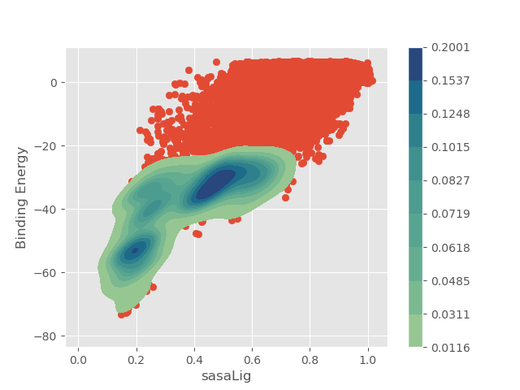

Analysis
============

Output folders
-----------------

Each simulation will create a number of output folders, as indicated on the tree below.

.. code:: console

    .
    └── LIG_Pele
        ├── output
        └── results
            ├── top_poses
            ├── plots
            └── clusters

The ``output`` folder contains raw output files such as detailed metrics reports and trajectory snapshots for every step, whereas the
``results`` directory holds a more user-friendly, curated output comprising of three separate folders:

- ``top_poses`` - top 100 lowest binding energy structures
- ``plots`` - plots of multiple metrics selected by the user
- ``clusters`` - lowest binding energy cluster representatives.

Interactive plots
-------------------
Additionally, you can create your own interactive plots. Go to the ``output`` folder and run the following command:

.. code-block:: console

 python -m pele_platform.Analysis.interactive_plot 6 5

The script requires two integer arguments indicating the numbers of report columns you would like to plot, in this
case we used columns 5 and 6 corresponding to the binding energy and SASA of the ligand. You can click on data points to get the file names of the structures.

.. image:: ../img/interactive_plot.png
  :width: 400
  :align: center

For more advanced interactive plots, please refer to `PELE++ documentation <https://nostrumbiodiscovery.github.io/pele_docs/intro/GeneralAnalysis/GeneralAnalysis.html>`_.

Kernel density estimate plot
-------------------------------

The KDE plots can aid the simulation analysis by visualising the distribution of ligand poses (similarly to a histogram)
in respect to plotted metrics, such as distance between two atoms (atom_dist) or solvent exposed surface area (SASA).
All you have to do is include the ``kde: true`` flag in your input.yaml. Additionally, you can influence the number of
poses plotted using the ``kde_structs`` flag, where the default included 1000 best energy poses.

.. code-block:: yaml

    kde: true
    kde_structs: 200

Example plot of binding energy vs ligand SASA with a KDE including 1000 best energy poses.

