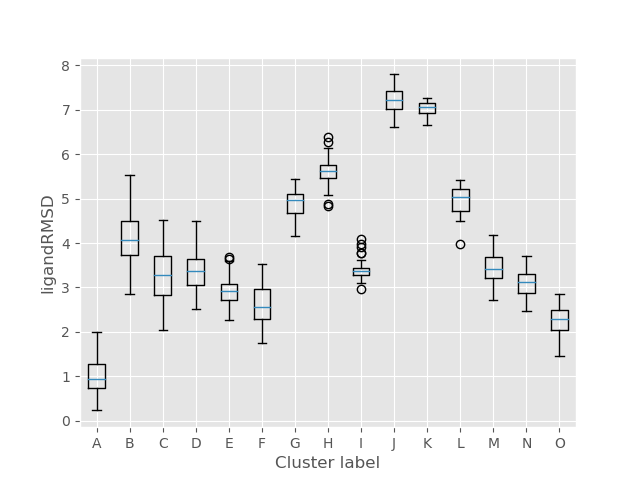

Analysis
============

Output files
-----------------

Folder structure
++++++++++++++++++

Each simulation will create a number of output folders, as indicated on the tree below.

.. code:: console

    .
    └── LIG_Pele
        ├── output
        └── results
            ├── top_poses
            ├── plots
            └── clusters

The ``output`` folder contains raw output files such as detailed metrics reports and trajectory snapshots for every step, whereas the
``results`` directory holds a more user-friendly, curated output comprising of three separate folders:

- ``top_poses`` - top 100 lowest binding energy structures
- ``plots`` - plots of multiple metrics selected by the user
- ``clusters`` - lowest binding energy cluster representatives and clustering plots.

Detailed metrics
++++++++++++++++++

Additionally, the simulation will create a two CSV files with more detailed metrics:

- ``results/data.csv`` contains a summary of all created poses together with their metrics and the clusters they belong to
- ``results/clusters/info.csv`` provides detailed metric on each cluster, such as its population, mean RMSD, energy percentiles, etc.

Plots
---------
The software will automatically create scatter plots for all metrics, however, if you want to enhance your analysis, you
can check out our PELE Plotter script. See :ref:`this tutorial<PlotterTutorial>` to get more information.

For more advanced interactive plots, please refer to `PELE++ documentation <https://nostrumbiodiscovery.github.io/pele_docs/intro/GeneralAnalysis/GeneralAnalysis.html>`_.

Kernel density estimate plot
++++++++++++++++++++++++++++++

The KDE plots can aid the simulation analysis by visualising the distribution of ligand poses (similarly to a histogram)
in respect to plotted metrics, such as distance between two atoms (atom_dist) or solvent exposed surface area (SASA).
All you have to do is include the ``kde: true`` flag in your input.yaml. Additionally, you can influence the number of
poses plotted using the ``kde_structs`` flag, where the default included 1000 best energy poses.

.. code-block:: yaml

    kde: true
    kde_structs: 200

Example plot of ligand RMSD vs binding energy.

.. image:: ../img/plotter_example1.png
  :width: 400
  :align: center

Clusters
-----------

Once the ligand clustering is finished, this folder will contain PDB files with the representatives of each selected cluster
(marked with a letter) as well as a CSV summary of metrics for all clusters, not only the selected one.

For each metrics there's a box plot to provide the user with a quick, intuitive overview of the clusters.

Moreover, the overall simulation metrics coloured by cluster are plotted to easily compare the performance of each cluster
throughout the simulation.

.. image:: ../img/cluster_scatter.png
  :width: 400
  :align: center
