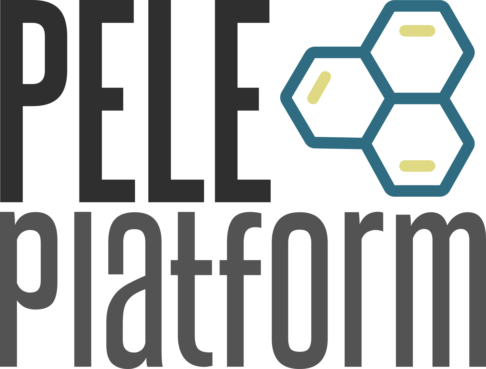

PELE Platform
================

PELE Platform is a suite of packages that aims to find novel solutions to drug discovery problems in a matter
of hours. We are constantly improving and developing new features, currently the following packages are available:

    - `Docking pose refinement <packages/docking/index.html>`_
    - `Pose scoring <packages/rescoring/index.html>`_
    - `Pocket exploration <packages/pocket_exploration/index.html>`_
    - `Protein-protein inhibitors <packages/ppi/index.html>`_
    - `High-throughput fragment growing <packages/frag/index.html>`_
    - `Growing custom fragment library <packages/libraries/index.html>`_
    - `GPCR orthosteric site exploration <packages/gpcr/index.html>`_
    - `Binding events <packages/binding/index.html>`_
    - `Biased simulation <packages/bias/index.html>`_
    - `Conformational change simulation <packages/pca/index.html>`_
    - `Protein minimization <packages/minimization/index.html>`_

You can also check out our repository on `github <https://github.com/NostrumBioDiscovery/pele_platform>`_!

Requirements
---------------

- Schrödinger Suite (any version)

.. toctree::
   installation/index.rst
   :hidden:

.. toctree::
   packages/index.rst
   :hidden:

.. toctree::
   flags/index.rst
   :hidden:

.. toctree::
   analysis/index.rst
   :hidden:

.. toctree::
   tutorials/index.rst
   :hidden:

.. toctree::
   errors/index.rst
   :hidden:

.. toctree::
   developers/index.rst
   :hidden:

.. toctree::
   changelog/index.rst
   :hidden:
