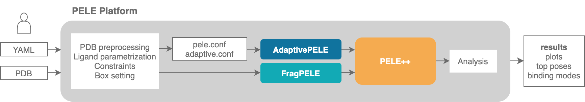

=======================
Input files preparation
=======================

PELE Platform essentially needs a minimum of two files in order to run:

    - ``system.pdb``: a PDB file that contains the structure to simulate with PELE.
      It typically contains a protein and a small molecule.
    - ``input.yaml``: a yaml file containing a collection of parameters to
      set up the simulation.

Additionally, although the Platform can create them automatically, we might
want to supply custom templates for our ligand or other non standard residues.

    - ``templates``: optionally, we can supply parameter templates or rotamer
      libraries for specific non standard residues.

Below we list several instructions to correctly prepare input PDB files for PELE:

.. toctree::
   :maxdepth: 2

   system_preparation.rst

On the other hand, the list of all parameters that can be specified in the
``input.yaml`` file can be found below:

.. toctree::
   :maxdepth: 2

   yaml.rst

Finally, the instructions to manage custom templates are:

.. toctree::
   :maxdepth: 2

   templates.rst
