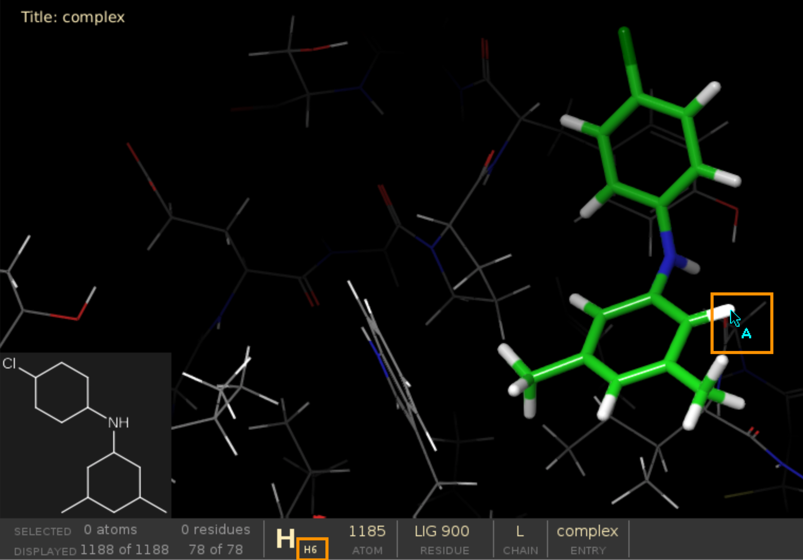

Grow a custom fragment library
================================

Introduction
-------------

FragPELE is now able to grow fragments from custom-made libraries! All you have to do is provide it with a directory
containing your fragments (in PDB or SDF format) and a docked core to let the software rank your fragments and return the
best binding modes for each.

Inputs
+++++++++

    - protein-scaffold PDB file
    - directory with fragment files (SDF or PDB)
    - input.yaml configuration file

Default parameters
+++++++++++++++++++

    - frag_eq_steps: 20
    - gr_steps: 6
    - frag_steps: 3

Recommendations
+++++++++++++++++

    #. Computational time is estimated between 30min and 3h per fragment (depending on the number of rotatable bonds).

1. Complex Preparation
-------------------------

Protein-scaffold PDB file
++++++++++++++++++++++++++++

The PDB file should be preprocessed with Maestro Protein Preparation Wizard. We usually recommend protonating the
protein (obligatory), deleting water molecules more than 5Å away from ligands and ions as well as filling in missing
loops and side chains.

The file must contain protein in complex with a fragment (scaffold), e.g. an X-ray structure or a docked pose.
Additionally, ensure the ligand has:

 - unique chain ID
 - no atom names with spaces or single letters (occasionally Maestro adds hydrogens named ``H1 2``, these need to be corrected)
 - any unique residue name, except for ``UNK``
 - well-defined aromatic bonds.

Directory with fragments
+++++++++++++++++++++++++

The fragment library should be preprocessed using Schrodinger LigPrep (default settings should be sufficient) and
have unique molecule names.

2. Input Preparation
---------------------

Prepare input.yaml file:

..  code-block:: yaml

    frag_core: "complex.pdb"  # Protein-scaffold complex
    frag_library: "/home/username/aromatic_library"  # Folder containing fragment files
    resname: "LIG"  # Ligand scaffold residue name
    chain_core: "L"  # Ligand scaffold chain ID
    frag_core_atom: "C6-H6"  # Connection point from which you want to grow the fragments
    cpus: 48

Defining frag_core_atom
++++++++++++++++++++++++++++

Not sure how to define ``frag_core_atom``?
Open your PDB file in Schrodinger Maestro and hover over the atoms to see their PDB names on the panel below.
The starting point for fragment growing should consist of a heavy atom and a hydrogen, e.g. "C6-H6" on the picture below.

3. Run simulation
--------------------

To run the system launch the simulation with the following command:

``python -m pele_platform.main input.yml``

4. Output
--------------

The simulation will create a TSV file with scored fragments as well as a number of fragment folders, the names of which will consist of the scaffold and molecule names.

Scored fragments
++++++++++++++++++

The list of all grown fragments together with their associated scores (average binding energy of the top 25% of all poses)
can be found in:

``simulation_score.tsv``

Top poses
++++++++++++

Each fragment folder contains a top_results folder with PDB files corresponding to the best poses for that fragment:

``fragment_folder/top_results/``

5. Analysis
--------------

Once your simulation is finished, you can run an automated analysis to retrieve most promising fragments based on their
proximity to a certain point, for example a side chain atom you would like your fragment to interact with.

All you have to do is adjust your input.yaml and launch it as before. Ensure you:

    - provide PELE with the path to your working folder, i.e. where you launched your simulation in the first place
    - set ``only_analysis: true``
    - set your desired coordinates in ``analysis_to_point``.

Example:

..  code-block:: yaml

    frag_core: "complex.pdb"  # Protein-scaffold complex
    frag_library: "/home/username/aromatic_library"  # Folder containing fragment files
    resname: "LIG"  # Ligand scaffold residue name
    chain_core: "L"  # Ligand scaffold chain ID
    frag_core_atom: "C6-H6"  # Connection point from which you want to grow the fragments
    only_analysis: true
    analysis_to_point: [24.835,  73.161,  17.026]
    working_folder: "/home/username/LIG_Pele"
    cpus: 48

The script will produce a ``point_analysis.csv`` file containing a number of columns:

    - **File**: Working folder

    - **BestFileDistance**: File with the best distance

        - Distance: Best distance to the point

    - **BestFileBE**: File with the best energy of the simulation

        - BE: Best energy

    - **BestFileNormalization**: File with the best distance and energy of the simulation **(recommended)**

        - BestNormalization: Best sqrt(distance^2 + energy^2)
        - DistanceBestNormalization: Best distance of the file above
        - BEBestNormalization: Best energy of the file above
