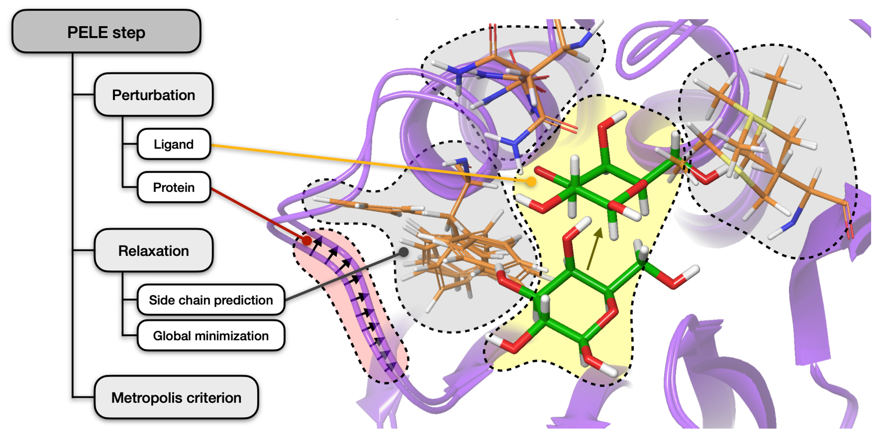
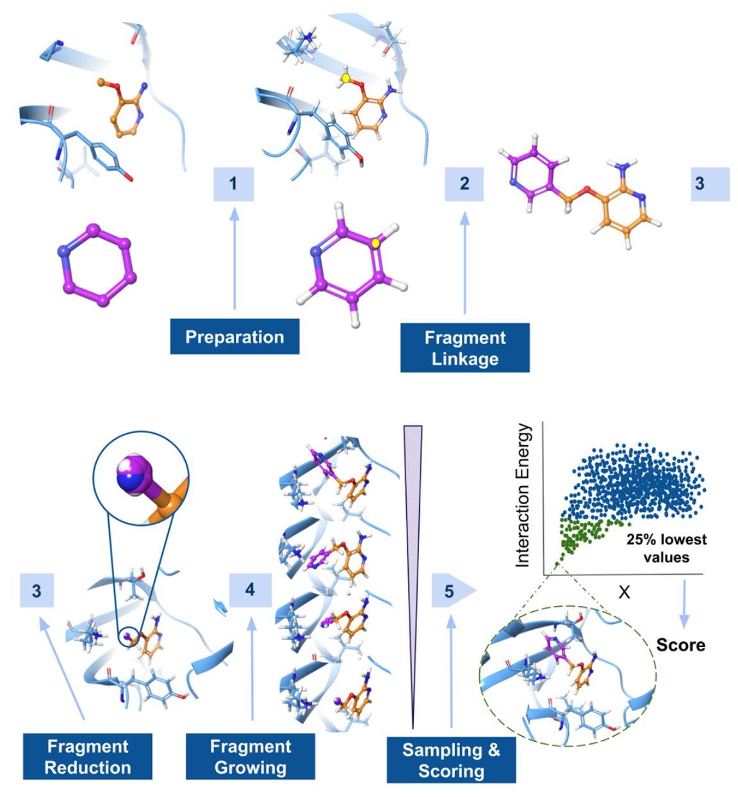

==========
PELE basis
==========

Our **Protein Energy Landscape Exploration** (PELE) tool combines protein structure prediction algorithms and Metropolis Monte Carlo techniques
to efficiently tackle tasks like predicting binding sites, docking pose refinement or modelling exit path of a ligand.

.. image:: ../img/induced_fit.gif
  :width: 400
  :align: center

If you would like to find out more about the C++ engine running underneath, please refer to the `PELE++ documentation <https://nostrumbiodiscovery.github.io/pele_docs/>`_.

PELE algorithm
--------------

Each simulation consists of several steps executing the following algorithm:

    **1. Perturbation.** Localized perturbation of the ligand (if present), involving random translation and rotation,
    followed by simple side chain relocation to avoid clashes. Additionally, the protein is minimized by driving alpha
    carbons to new positions resulting from a small displacement in a low frequency anisotropic normal mode (ANM).

    .. note::
        This step might also involve water perturbation - find out more about `AquaPELE`_.

    **2. Relaxation.** Optimization of side chains in proximity to the ligand as well as those whose energy changed the
    most during ANM, using a rotamer library with a resolution of 10°. This is followed by a global minimization with
    Truncated Newton minimizer.

    **3. Acceptance.** The new structure is accepted or rejected based on the Metropolis criterion.

AdaptivePELE
------------

AdaptivePELE is a Python package developed around the core PELE algorithm aimed to **enhance the exploration** of standard
molecular simulations by iteratively running short simulations, assessing the exploration with a clustering, and
spawning new trajectories in regions of interest.

The algorithm is composed of three main steps: sampling, clustering, and spawning, which run in an iterative approach.

    **1. Sampling.** During this phase, several trajectories are run independently to generate a number of uncorrelated poses.

    **2. Clustering.** Obtained conformations are clustered using the leader algorithm based on ligand RMSD.

    **3. Spawning.** In the last step, the initial structures (seeds) for the next iteration are selected with the goal
    of improving the search in poorly sampled regions or to optimize a user-defined metric.

.. image:: https://adaptivepele.github.io/AdaptivePELE/_images/adaptiveDiagram.png
  :width: 400
  :align: center

AquaPELE
--------

AquaPELE extends the exploration capabilities of the standard PELE algorithm by introducing and additional Monte Carlo
step to **perturb water molecules** inside protein cavities and dynamically adjust their effects to the current state of
the system.

The implementation employs a mixed implicit/explicit approach which allows prediction of the principal hydration sites
or the rearrangement and displacement of conserved water molecules upon the binding of a ligand while retaining the
efficiency.

FragPELE
--------

FragPELE is a new tool for *in silico* hit-to-lead drug design, capable of **growing a fragment** into a core while exploring
the protein-ligand conformational space.

.. image:: ../img/frag_pele.gif
  :width: 300
  :align: center

The software is intended to automatically grow one or more fragments onto different hydrogens of the same scaffold, the
overall method is composed of five steps, as outlined below:

    **1. Preparation.** Preprocessing of the PDB file to ensure the protein and the scaffold are correctly protonated and
    have assigned bond orders.

    **2. Fragment linkage.** In order to link the fragment to the scaffold, the coordinates of the hydrogens associated with
    user-defined heavy atoms will be aligned, and the hydrogens will be subsequently deleted to create a new bond.

    **3. Fragment reduction.** The bonding and non-bonding terms of the fragment atoms are reduced to later be grown
    dynamically within the binding site.

    **4. Fragment growing.** The new fragment is grown within a few epochs using the AdaptivePELE methodology. At each
    epoch, the atoms' parameters are linearly increased and a few PELE steps are performed to account for the receptor
    flexibility.

    **5. Sampling & scoring.** Once the ligand is completely grown, a longer PELE simulation is performed to score the
    and map the whole protein-ligand conformational space.

Further reading
---------------

Over the years, numerous publications have been written about the methodology and applications of PELE itself, as well
as further improvements, such as AdaptivePELE or FragPELE.

* `PELE: Protein Energy Landscape Exploration. A Novel Monte Carlo Based Technique <https://pubs.acs.org/doi/abs/10.1021/ct0501811>`_ by Kenneth W. Borrelli, Andreas Vitalis, Raul Alcantara, and Victor Guallar

* `Adaptive simulations, towards interactive protein-ligand modeling <https://www.nature.com/articles/s41598-017-08445-5>`_ by Daniel Lecina, Joan F. Gilabert, and Victor Guallar

* `aquaPELE: A Monte Carlo-Based Algorithm to Sample the Effects of Buried Water Molecules in Proteins <https://pubs.acs.org/doi/10.1021/acs.jctc.0c00925>`_ by Martí Municoy, Sergi Roda, Daniel Soler, Alberto Soutullo, and Victor Guallar

* `FragPELE: Dynamic Ligand Growing within a Binding Site. A Novel Tool for Hit-To-Lead Drug Design <https://pubs.acs.org/doi/10.1021/acs.jcim.9b00938>`_ by Carles Perez, Daniel Soler, Robert Soliva, and Victor Guallar
