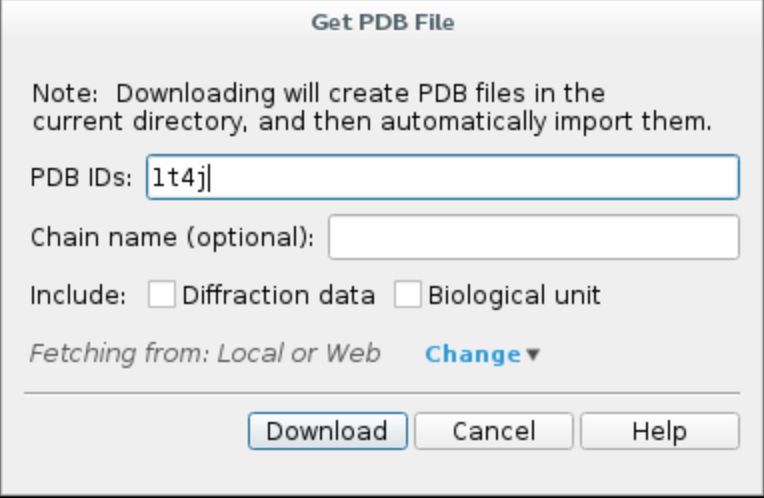

Allosteric simulation - tutorial (unfinished)
=================================================
In this tutorial we will set up a **pocket exploration** simulation aimed to discover allosteric binding sites in the protein.
We will be using protein tyrosine phosphatase 1B (PDB code 1T4J) as an example, but feel free to follow the steps using a
protein of your choice.

1. Protein preparation
+++++++++++++++++++++++

First, we will import the complex from Protein Data Bank and preprocess it using Schrödinger Maestro (release 2020-1).

a. Launch Maestro and **import the structure from PDB** by clicking ``File -> Get PDB...``, type in your PDB ID, e.g. ``1T4J``,
and click ``Download``. The protein structure should appear in your workspace.

b. **Preprocess the protein** using Protein Preparation Wizard. Click on ``Tasks`` and search ``Protein Preperation Wizard``.
Check the following options and hit ``Preprocess``.
    - Fill in missing side chain using Prime
    - Fill in missing loops using Prime
    - Delete waters beyond 5.0 Å from het groups

.. image:: ../img/allosteric_tutorial_1b.png
  :width: 400
  :align: center

The preprocessing might take a few minutes. Upon completion, you should see ``1T4J - preprocessed`` on the entry list.

c. **Change ligand chain ID and residue name**
    - Click on ``Select -> Set pick level -> Residues``, then select the ligand with a mouse click
    - Open ``Builder`` and choose ``Other edits -> Change atom properties...``
    - Set residue name to ``LIG`` and chain name to ``Z``
    - Choose ``PDB atom name`` from the drop down list and select ``Set unique PDB atom names within residues``
    - Click ``Apply`` and close the window.

.. image:: ../img/allosteric_tutorial_1c1.png
  :width: 400
  :align: center

.. image:: ../img/allosteric_tutorial_1c2.png
  :width: 400
  :align: center

d. **Export structure** by clicking on ``File -> Export structures...`` and save all workspace atoms as ``complex.pdb``
in your working directory.

e. **Pick atoms** to track progress. One of the metrics we use to follow the simulation is the distance between two
selected atoms. In this case, we will pick one atom from the ligand and one from the protein, e.g.
    - ligand atom ``Z:299:C3``
    - protein atom ``A:178:CA``.

The atom strings need to follow ``chain ID:residue number:atom name`` format, you can easily check those values on the
bottom panel in Maestro by hovering the mouse pointer over a specific atom.

.. image:: ../img/allosteric_tutorial_1e.png
  :width: 400
  :align: center

You can close Maestro now.

2. PELE input file
++++++++++++++++++++

Create ``input.yaml`` file in your working directory, it should contain the following flags:

    - **system** - path to your PDB file
    - **chain** - ligand chain ID, which we set as ``Z`` in step 1c
    - **resname** - ligand residue name, in our case ``LIG``
    - **allosteric** - flag to run pocket exploration
    - **atom_dist** - strings representing atoms selected in point 1e
    - **seed** - random seed used in Monte Carlo steps, you should keep it consistent to ensure reproducibility of the results
    - **cpus** - number of CPUs you want to use for the simulation (we suggest a minimum of 50 for a normal simulation, but you could lower it for training purposes only).

..  code-block:: yaml

    system: "complex.pdb"
    chain: "Z"
    resname: "LIG"
    allosteric: true
    atom_dist:
    - "Z:299:C3"
    - "A:178:CA"
    seed: 12345
    cpus: 60

3. Launching the simulation
+++++++++++++++++++++++++++++

Once you have ``complex.pdb`` and ``input.yaml`` in your working directory, you can launch the simulation using one of the following methods:

    - **directly** on command line using ``python -m pele_platform.main input.yaml``

    - submit a slurm file to the **queue system** (ask your IT manager, if you are not sure how to do it). In our case, the slurm file is called ``run.sl`` and we can launch it on the command line using ``sbatch slurm.sl``

Example slurm file:

.. code-block:: console

    #!/bin/bash
    #SBATCH -J PELE
    #SBATCH --output=mpi_%j.out
    #SBATCH --error=mpi_%j.err
    #SBATCH --ntasks=60
    #SBATCH --mem-per-cpu=1000

    python -m pele_platform.main input.yaml

4. Analysis of the results
++++++++++++++++++++++++++++

The pocket exploration consists of two steps. Initially, the position of the ligand is randomised all around the protein
to perform **global exploration**. Then, all results are clustered based on ligand coordinates and the best binding energy
representative of each cluster is selected as input for the **refinement simulation**.

For the analysis part, we will only be concerned with the refinement simulation output, however, the same rules would apply to
the global exploration output or any other PELE simulation.

a. Plots
-------------

1. Got to ``LIG_Pele/2_refinement_simulation/results/Plots/`` folder. It should contain a number of plots which allow you to get a
general idea of the progression of the simulation.

2. Examine ``distance0.5_Binding_Energy_plot.png`` showing the relationship between the binding energy and the distance between two selected atoms.

<insert plot screenshot here>

3. Examine ``...``

b. Selected binding modes
-------------------------

1. Go to ``LIG_Pele/2_refinement_simulation/results`` folder, which contains the best binding poses split into two categories:

    - ``clusters`` contains the best binding energy representatives of each cluster
    - ``BestStructs``  holds top 100 best binding energy structures.

2. ....

<insert screenshots>
