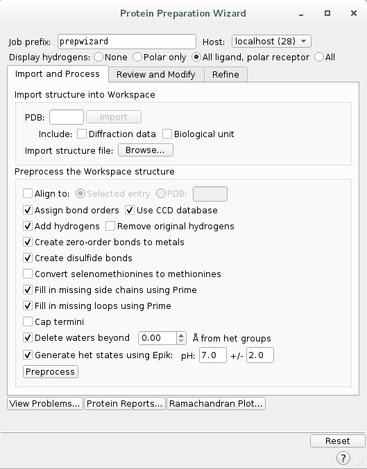

FRAG_PELE
========================================

`FragPELE <https://pubmed.ncbi.nlm.nih.gov/32027130/>`_  is a new tool for in silico hit-to-lead drug design, capable of growing a fragment from a bound core while exploring the protein-ligand conformational space.

This tutorial aims to describe the general protocol to run FragPELE.

Previous Requisites
-----------------------

* **Complex PDB:** The PDB processed file. Prepare the system with the **Schrödinger Protein Preparation Wizard**. It is recommended to delete all water molecules as well as filling in missing loops and side chains.
It is obligatory that the protein is protonated.
Furthermore, make sure the ligand has:
    * A unique chain ID.
    * Unique PDB atom names with no spaces or single letters.
    * NO residue name except for UNK.

* **Fragment PDB:** The PDB with the desired fragment. The chain of the fragment **must be renamed to "L"**.

Launch a FragPELE simulation
---------------------------------

1. Protein Preparation
-----------------------

a. Launch Schrödinger Maestro.
b. Click ``File -> Get PDB`` and type your PDB ID to import the structure.

.. image:: ../img/frag_pele_tutorial_1b.png
  :width: 400
  :align: center

.. image:: ../img/frag_pele_tutorial_1b.2.png
  :width: 400
  :align: center

c. To preprocess the protein, go to ``Tasks`` and search for ``Protein Preparation Wizard``. Select the following options:

Click ``Preprocess`` to start the preprocessing of the protein. 

d. Change the ligand chain ID and the residue name.
    - Go to ``Select -> Set pick level -> Residues``.

    .. image:: ../img/frag_pele_tutorial_1d.1.png
      :width: 400
      :align: center

    - Select the ligand with a mouse click.
    - Go to ``Build`` and click on ``Other edits -> Change atom properties``.

    .. image:: ../img/frag_pele_tutorial_1d.3.png
      :width: 400
      :align: center

    - Change ``Residue Name`` to ``LIG``.
    - Change ``Chain Name`` to ``Z``.

    .. image:: ../img/frag_pele_tutorial_1d.4.png
      :width: 400
      :align: center

    - Select ``PDB atom name`` from the drop down list and select ``Set unique PDB atom names within residues``.

    .. image:: ../img/frag_pele_tutorial_1d.5.png
      :width: 400
      :align: center

    - Click ``Apply``.
    - Close the window.
e. Finally, export the structure by going to ``File -> Export structures`` and save it to your working directory. 

2. Ligand Preparation
------------------------
a. Select the ligand with a mouse click and extract it to a separate entry opening ``Build`` and clicking ``Copy selected atoms to new entry``. 

b. Now define the R-groups:

    -  Hit ``Select -> Set pick level -> Atoms``.

    .. image:: ../img/frag_pele_tutorial_2b.2.png
      :width: 400
      :align: center

    -  Click on any hydrogen atoms adjacent to a Nitrogen.
    -  Go to ``Tasks -> Enumeration -> Custom R-Group``.
    -  Choose ``R-groups to Create a Hydrogen Bond`` from the drop down list.

    .. image:: ../img/frag_pele_tutorial_2b.4.png
      :width: 400
      :align: center

    - Click ``Run`` to submit the job.

c. A new group on the entry list is created once the job finishes. Select all enumerated ligands by clicking on the group.
d. Go to ``Tasks -> LigPrep``
e. Check the following options and hit ``Run``.

.. image:: ../img/frag_pele_tutorial_2e.png
  :width: 400
  :align: center

f. A new group on the entry list is created after LigPrep finishes. Select all the entries of the group as in step ``2c``.
g. Go to ``Export -> Structures`` and save the file as ``ligands.sdf`` in your working directory.

3. YAML Input File
----------------------
The input file ``input.yaml`` must contain:

	1. **frag_core:** Path to the processed PDB file containing the protein and docket scaffolds.
	2. **frag_ligands:** Path to the SD file wit fully grown and preprocessed ligands.
	3. **resname:** Unique residue name of the scaffold.
	4. **chain_core:** Unique chain ID of the scaffolds.
	5. **cpus:** Number of CPUs to use.

.. code-block:: yaml
    
    frag_core: "scaffold.pdb"
    frag_ligands: "ligands.sdf"
    resname: "LIG"
    chain_core: "Z"
    cpus: 50

**Note:** It is recommended to first run the simulation including **test:true** in the ``input.yaml`` file to check that everything works. The test will be executed with 5 CPUs.

.. code-block:: yaml

    frag_core: "scaffold.pdb"
    frag_ligands: "ligands.sdf"
    resname: "LIG"
    chain_core: "Z"
    test: true

4. Launching FragPELE
-----------------------
To run the system launch the simulation with the following command:

.. code-block:: python

    python -m pele_platform.main input.yaml

5. Results
--------------

The simulation will create a folder with the following organization:
    - **pregrow:** Contains the initial PDB files.
    - **growing_steps:** There is a folder for each growing step from the simulation. In each of these folderes, there is:

        - A report file for each CPU launched. This report contains the information of the number of the task, the number of accepted Pele steps, the current energy and binding energy of each step and the sasaLig, which is the solvent accesible surface area.
        - A PDB file of the trajectory. 

    - **sampling_result:** Growed fragment from each trajectory. 

	- **top_result:** Top results from each trajectory.

    .. image:: ../img/top_result_frag_pele.png
      :width: 400
      :align: center

    - **clustering_PDBs:** There is a folder for each growing step from the simulation. In each of the folders there is:

        - Initial PDB file for each trajectory.  

    - **control_folder:** ``conf`` file for each growing step from the simulation.
    - **DataLocal:** Contains the ligand templates. When you run a simulation, the ligands are parametrized and stored in this folder.
    - **top_result.pdb:** PDB file of the top result from the simulation.
    - **pele_template.conf**

Optative Flags
------------------

See `here <../documentation/frag/index.html>`_ the optative flags for FragPELE.
