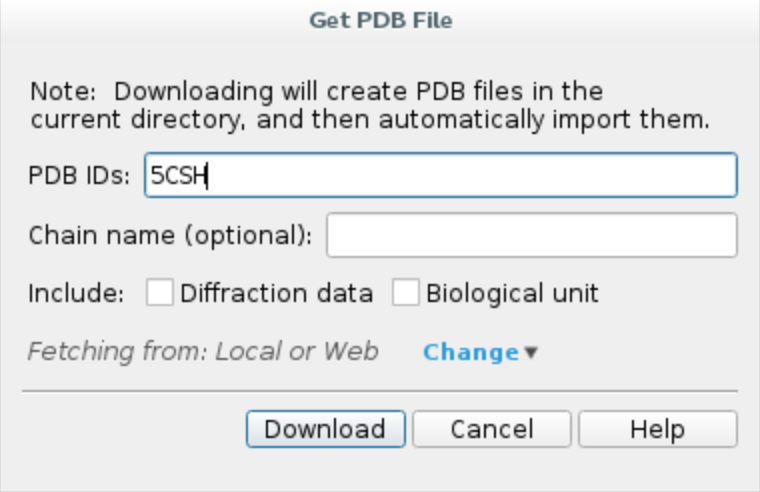
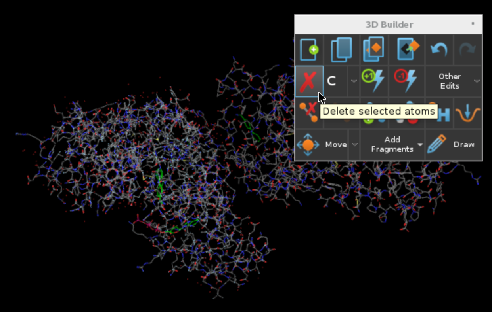
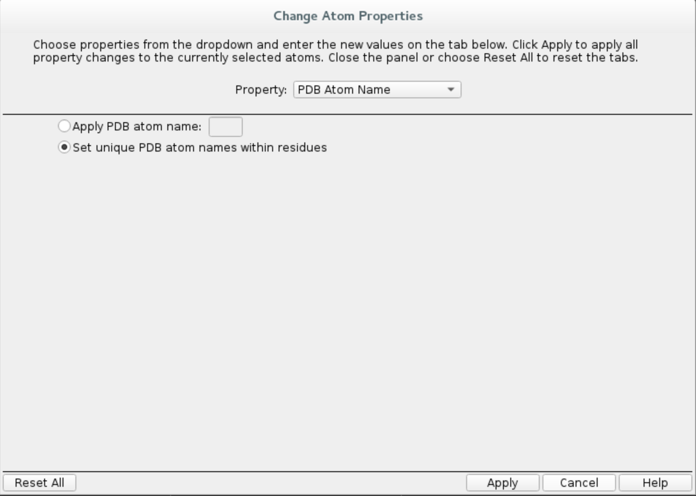
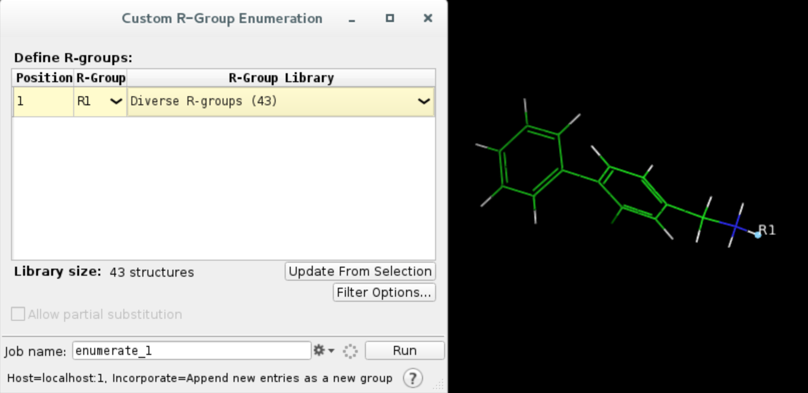
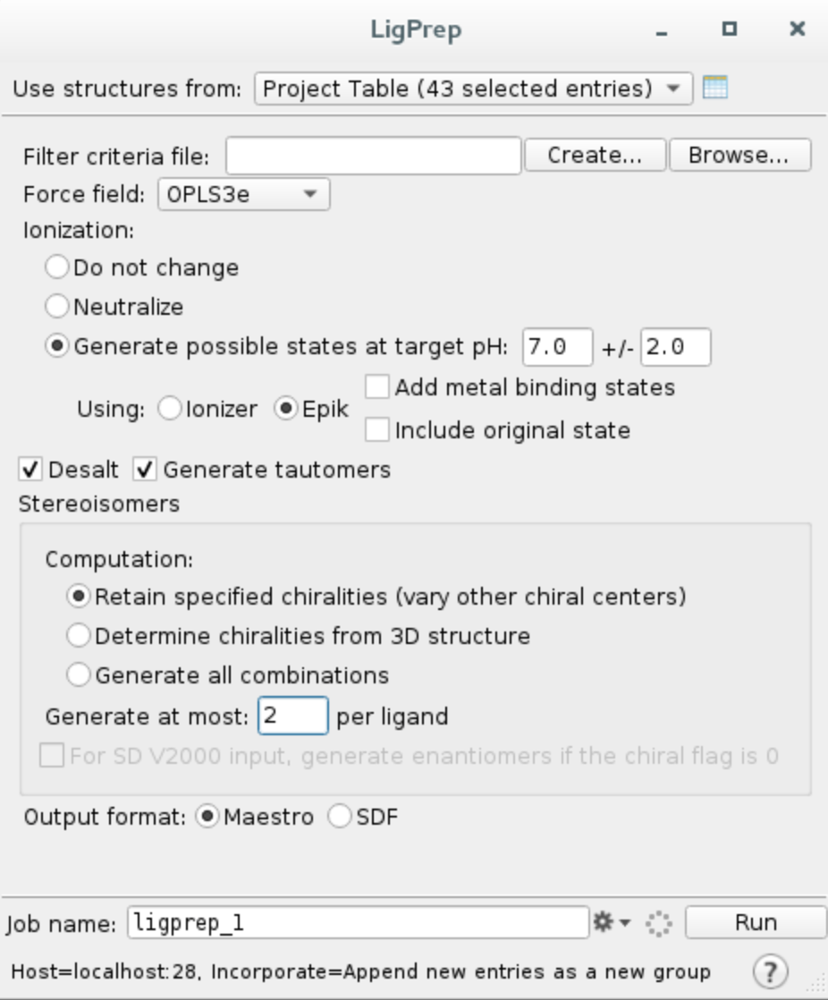

Fragment growing tutorial (unfinished)
========================================

The aim of this tutorial is to familiarise the user with FragPELE, a novel tool to perform fragment growing onto a scaffold
in a high-throughput manner, taking into account the receptor flexibility.

We will be using casein kinase II subunit alpha structure crystallised with a fragment (PDB code 5CSH) as an example system.

1. Protein preparation
+++++++++++++++++++++++

First, we will import the complex from Protein Data Bank and preprocess it using Schrödinger Maestro (release 2020-1).

a. Launch Maestro and **import the structure from PDB** by clicking ``File -> Get PDB...``, type in your PDB ID, e.g. ``5CSH``,
and click ``Download``. The protein structure should appear in your workspace.

b. As you can see, the crystal structure is **duplicated**. Click on ``Select -> Set pick level -> Chains``, then select chain B in the workspace. Open ``Build`` window and remove
selected atoms. This way we will be left with a single protein-scaffold complex.

c. **Preprocess the protein** using Protein Preparation Wizard. Click on ``Tasks`` and search ``Protein Preparation Wizard``.
Check the following options and hit ``Preprocess``.
    - Fill in missing side chain using Prime
    - Fill in missing loops using Prime
    - Delete waters beyond 5.0 Å from het groups

.. image:: ../img/allosteric_tutorial_1b.png
  :width: 400
  :align: center

Maestro will warn you about three residues with double occupancy issues. Simply select them all, click ``Commit`` and then
``Update`` to ensure there are no more problems with the protein.

.. image:: ../img/fragment_growing_tutorial_1c.png
  :width: 400
  :align: center

Upon completion, you should see ``5CSH - preprocessed`` on the entry list.

d. **Change ligand chain ID and residue name**
    - Click on ``Select -> Set pick level -> Residues``, then select ligand ``54E`` (residue 401) with a mouse click
    - Open ``Build`` and choose ``Other edits -> Change atom properties...``
    - Set residue name to ``LIG`` and chain name to ``Z``
    - Choose ``PDB atom name`` from the drop down list and select ``Set unique PDB atom names within residues``
    - Click ``Apply`` and close the window

.. image:: ../img/allosteric_tutorial_1c1.png
  :width: 400
  :align: center

e. **Export structure** by clicking on ``File -> Export structures...`` and save all workspace atoms as ``scaffold.pdb``
in your working directory.

2. Ligands
++++++++++++

FragPELE requires an SD file with fully grown ligands (scaffold + R-group) as input. Maestro provides an easy tool to enumerate
a library of fragments onto a selected hydrogen in your scaffold.

a. **Extract the ligand** to a separate entry by selecting it (just like in step 1d), opening ``Build`` and clicking ``Copy
selected atoms to new entry``.

.. image:: ../img/fragment_growing_tutorial_2a.png
  :width: 400
  :align: center

b. **Enumerate R-groups**

    - Click on ``Select -> Set pick level -> Atoms`` and select the nitrogen atom, then
    - Click on ``Select -> Set pick level -> Atoms`` and select any of the hydrogen atoms adjacent to nitrogen
    - Click on ``Tasks``, search for ``Enumeration`` and select ``Enumeration > Custom R-Group...``
    - Choose ``Diverse R-groups`` from the drop down menu and ``Run``

Once the job has finished, you will notice a new group on your entry list called ``enumerate_1``.

c. **Prepare ligands**

    - Select all enumerated ligands by clicking on the ``enumerate_1`` group
    - Click on ``Tasks`` and search for ``LigPrep``
    - Run LigPrep making sure you use selected structures from the project table and generate at most 2 stereoisomers per ligand (otherwise it will return a lot of structures)

d. **Export as SD file**

Once ligand preparation is finished (it might take a few minutes), select all entries in ``ligprep_1-out1`` group and right click on the list
``Export -> Structures...`` and save the file as ``ligands.sdf``.

3. FragPELE input file
++++++++++++++++++++++++

4. Launching the simulation
+++++++++++++++++++++++++++++

5. Analysis of the results
++++++++++++++++++++++++++++
