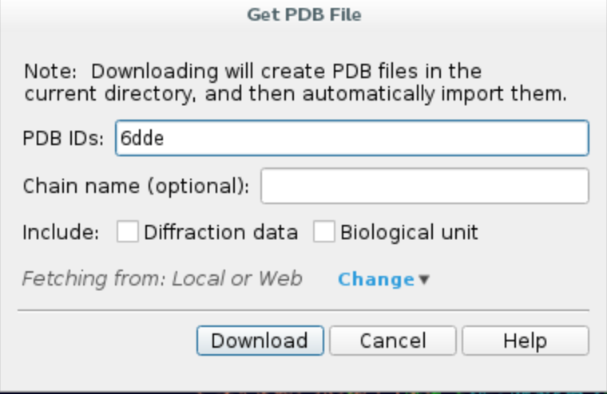
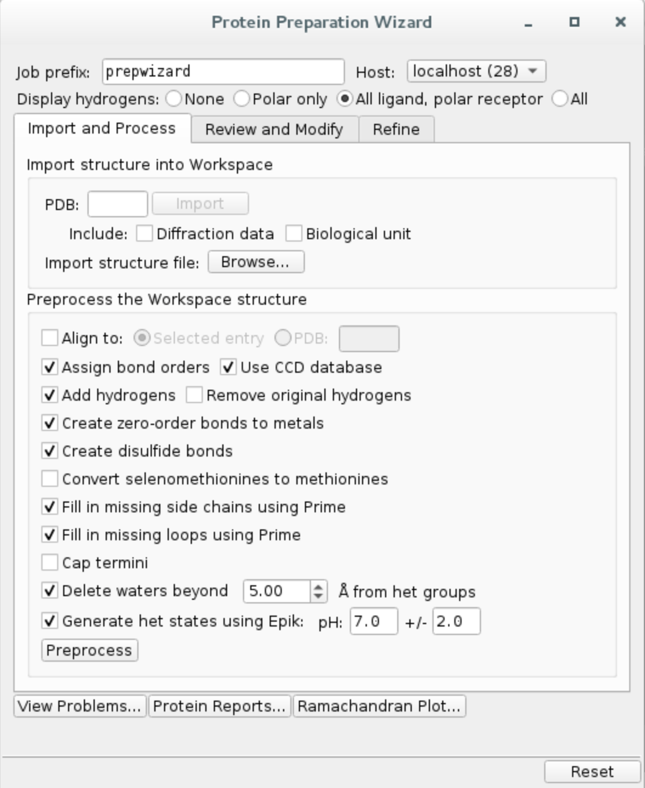
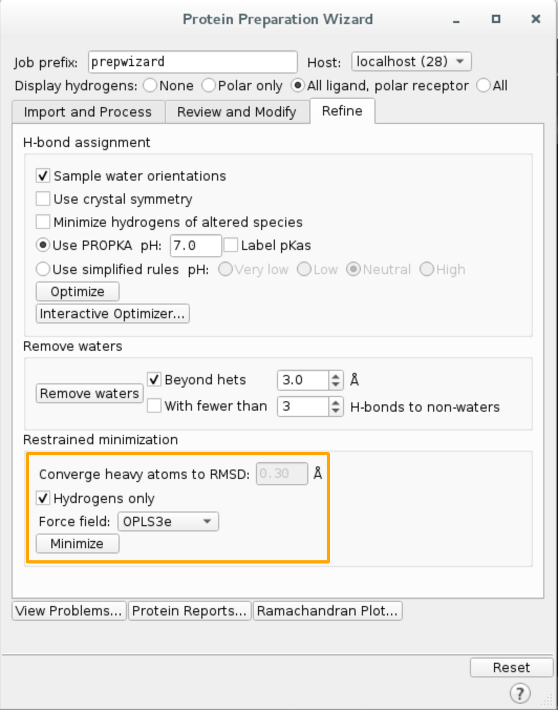
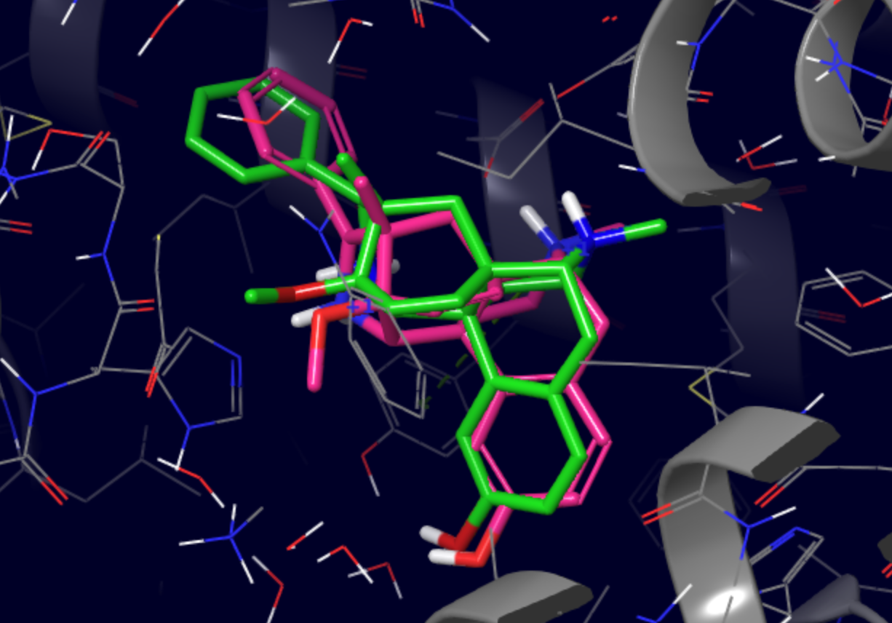
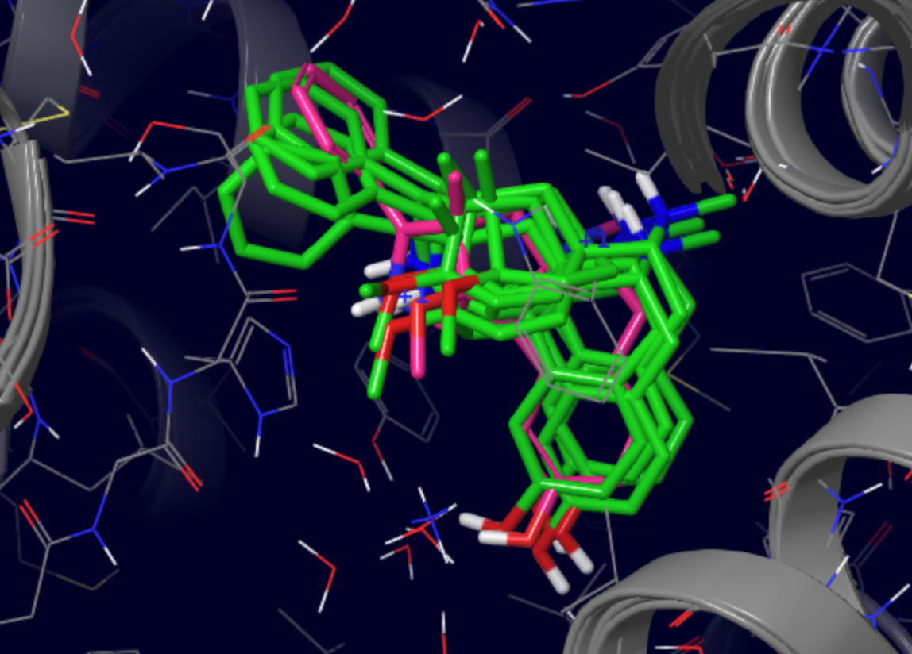

GPCR tutorial
=================================================

In this tutorial we will run a GPCR cross-simulation which aims to find the path of BU72 agonist (PDB code 5C1M)
to the orthosteric site of μ-opioid receptor (PDB code 6DDE).

Initially, the software will randomise the position of the ligand around the specified initial site, then perform a simulation
slightly biased against the solvent accessible surface area. The setup will automatically constrain α-carbons to prevent the collapse of
the initial structure due to the lack of membrane as well as set up a simulation box encompassing both the initial and the orthosteric site.

1. Protein preparation
+++++++++++++++++++++++

We will import the complex from Protein Data Bank and preprocess it using Schrödinger Maestro (release 2020-1).

a. Launch Maestro and **import the structure from PDB** by clicking ``File -> Get PDB...``, type in your PDB ID, e.g. ``6DDE``,
and click ``Download``. The protein structure should appear in your workspace.

b. Remove redundant chains from the structure. Click on ``Select -> Set pick level -> Chains``, then in the workspace select all chains except for R. Open ``Build`` window and remove
selected atoms.

c. **Preprocess the protein** using Protein Preparation Wizard. Click on ``Tasks`` and search ``Protein Preparation Wizard``.
Check the following options and hit ``Preprocess``.
    - Fill in missing side chain using Prime*
    - Fill in missing loops using Prime*
    - Delete waters beyond 0.0 Å from het groups (i.e. all waters in the system)

\*If you do not have Prime license, you can skip those steps.

The preprocessing might take a few minutes... Afterwards, Maestro will warn you about overlapping hydrogen atoms - to resolve it, simply go to ``Refine``
tab of the Protein Preparation Wizard and perform restrained minimization on hydrogens only.

In the end you should see ``6DDE - minimized`` entry in the table on your left.

2. Ligand preparation
+++++++++++++++++++++++++

a. Import structure ``5C1M`` from PDB and preprocess with Protein Preparation Wizard like before. Maestro will prompt you about
some double occupancy issues, you can resolve them by selecting all entries and clicking ``Commit``.

b. **Extract the ligand** and change its chain ID and residue name
    - Click on ``Select -> Set pick level -> Residues``, then select ligand ``4VO`` (residue 401) with a mouse click
    - Open ``Build`` and choose ``Other edits -> Change atom properties...``
    - Set residue name to ``LIG`` and chain name to ``Z``
    - Choose ``PDB atom name`` from the drop down list and select ``Set unique PDB atom names within residues``
    - Click ``Apply`` and close the window
    - In ``Build`` window click the button highlighted below to extract the ligand to a separate entry.

.. image:: ../img/gpcr_tutorial_2b.png
  :width: 300
  :align: center

c. **Merge** the protein and the ligand entries:
    - Select both enties by holding Ctrl button
    - Right click and choose ``Merge``.

This will create a new entry containing both preprocessed 5C1M ligand and 6DDE receptor structure. The initial position of the ligand does not matter since PELE automatically
moves it to the simulation box created based on the specified initial and orthosteric sites.

d. **Pick atom** to track progress. One of the metrics we use to follow the simulation is the distance between two
selected atoms. In this case, we will pick ligand atom ``Z:401:C13`` and then track its distance to the orthosteric site.

e. **Export merged structure** by clicking on ``File -> Export structures...`` and save all workspace atoms as ``complex.pdb``
in your working directory. You can close Maestro now.

3. PELE input file
++++++++++++++++++++

Create ``input.yaml`` file in your working directory, it should contain the following flags:

    - **system** - path to the protein-ligand PDB file
    - **chain** - ligand chain ID, here ``Z``
    - **resname** - ligand residue name, in our case ``LIG``
    - **gpcr_orth** - sets the defaults for the GPCR simulation
    - **orthosteric_site** - atom in the orthosteric site
    - **initial_site** - atom in the initial site
    - **atom_dist** - atoms used to track the progress of the simulation, we will use one from the ligand and one from the receptor, following ``chain ID:residue number:atom name`` format
    - **cpus** - number of CPUs you want to use for the simulation (we suggest a minimum of 50 for a normal simulation, but you could lower it for training purposes only)
    - **seed** - random seed to ensure reproducibility.

..  code-block:: yaml

    system: 'complex.pdb'
    chain: 'Z'
    resname: 'LIG'
    gpcr_orth: true
    initial_site: "R:212:OE1" # Gln212 oxygen
    orthosteric_site: "R:124:NE2" # Gln124 interacting with the 6DDE ligand
    seed: 12345
    cpus: 50
    atom_dist:
    - "R:124:NE2"
    - "Z:401:C13"

**We strongly recommend running a test first to ensure all your input files are valid.** Simply include ``test: true`` in your input.yaml and launch the simulation. If it finishes correctly, you can remove the test flag and start a full production run.
Otherwise, inspect the logs and correct any mistakes indicated in the error codes.

4. Launching the simulation
+++++++++++++++++++++++++++++

Once you have ``complex.pdb`` and ``input.yaml`` in your working directory, you can launch the simulation using one of the following methods:

    - **directly** on command line using ``python -m pele_platform.main input.yaml``

    - submit a slurm file to the **queue system** (ask your IT manager, if you are not sure how to do it). In our case, the slurm file is called ``run.sl`` and we can launch it on the command line using ``sbatch slurm.sl``

Example slurm file:

.. code-block:: console

    #!/bin/bash
    #SBATCH -J PELE
    #SBATCH --output=mpi_%j.out
    #SBATCH --error=mpi_%j.err
    #SBATCH --ntasks=50
    #SBATCH --mem-per-cpu=1000

    python -m pele_platform.main input.yaml

5. Analysis of the results
++++++++++++++++++++++++++++

To ensure the simulation has finished, check the standard output file (in our case ``mpi_xxxxx.out``, as indicated in the slurm file). It should contain the
following line at the end:

.. code-block:: console

    Pdf summary report successfully writen to: /your_working_directory/LIG_Pele/summary_results.pdf`

All relevant simulation results, including best energy poses, clusters and plots are located in ``LIG_Pele/results`` directory. We will now explore
the content of each folder.

a. Plots
----------

The ``Plots`` directory contains several plots to help you get the general idea of the progress of the simulation, showing relationships between
the binding energy and solvent accessible surface area of the ligand, distance between two selected atoms or any other metric of your choice.

For example, the following plot clearly shows how binding energy improves as the distance between the ligand and the orthosteric site decreases.

.. image:: ../img/gpcr_tutorial_5a.png
  :width: 400
  :align: center

b. Best structures
--------------------

PELE scans all produced poses and retrieves the top 100 lowest binding energy structures to the ``BestStructs`` folder. The file names indicate
the trajectory and model IDs of each structure as well as its associated binding energy.

Shown below is an example of a pose with binding energy of -91.1362 (green) superposed with
the original native structure (pink). The RMSD between the two ligands was 1.88 Å and most pharmacophore features were correctly reproduced.

c. Clusters
---------------

To ensure no binding modes were omitted in the previous step, we also cluster all poses based on ligand heavy atom coordinates and retrieve the lowest
binding energy representative of each cluster. In this case, four cluster representatives show a similar binding mode to the one discussed above.

For more information regarding the outputs of the tutorial see `Output files <outputs.html>`_

