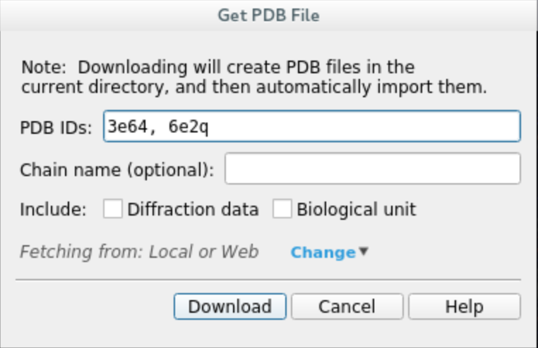
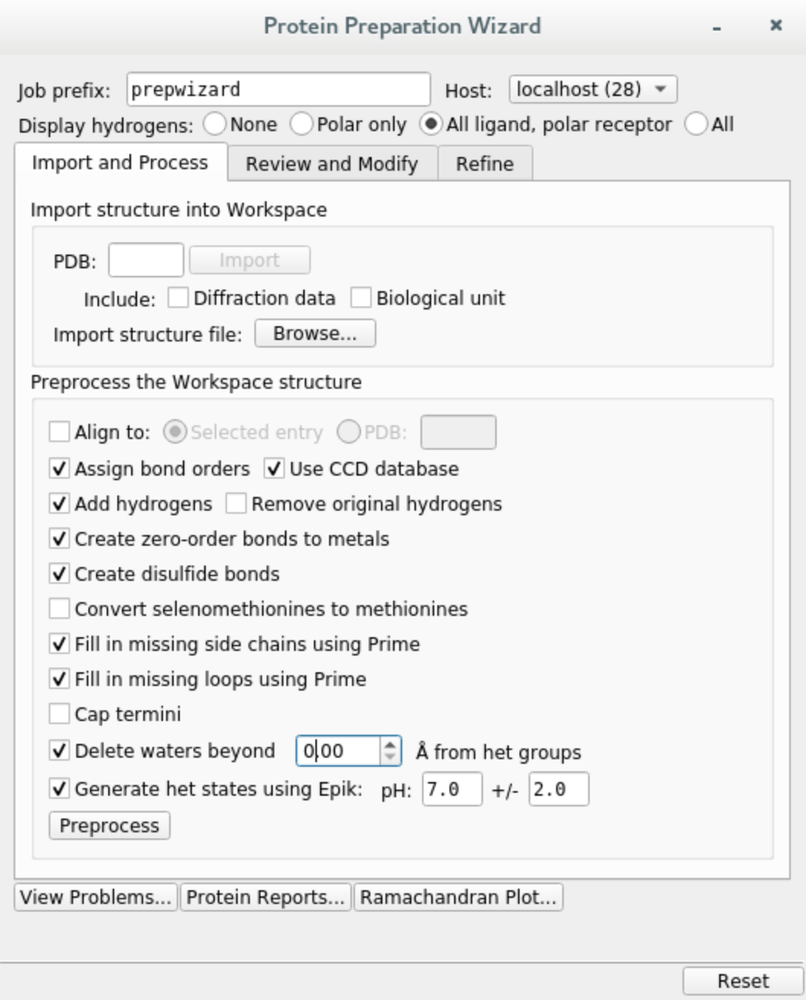
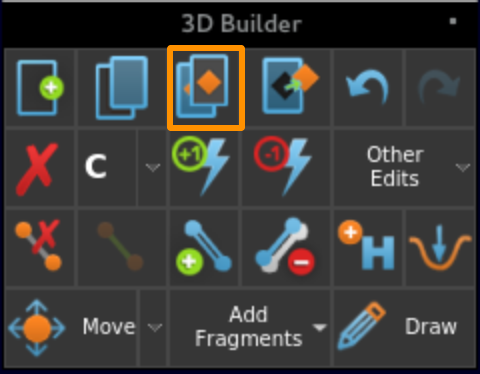
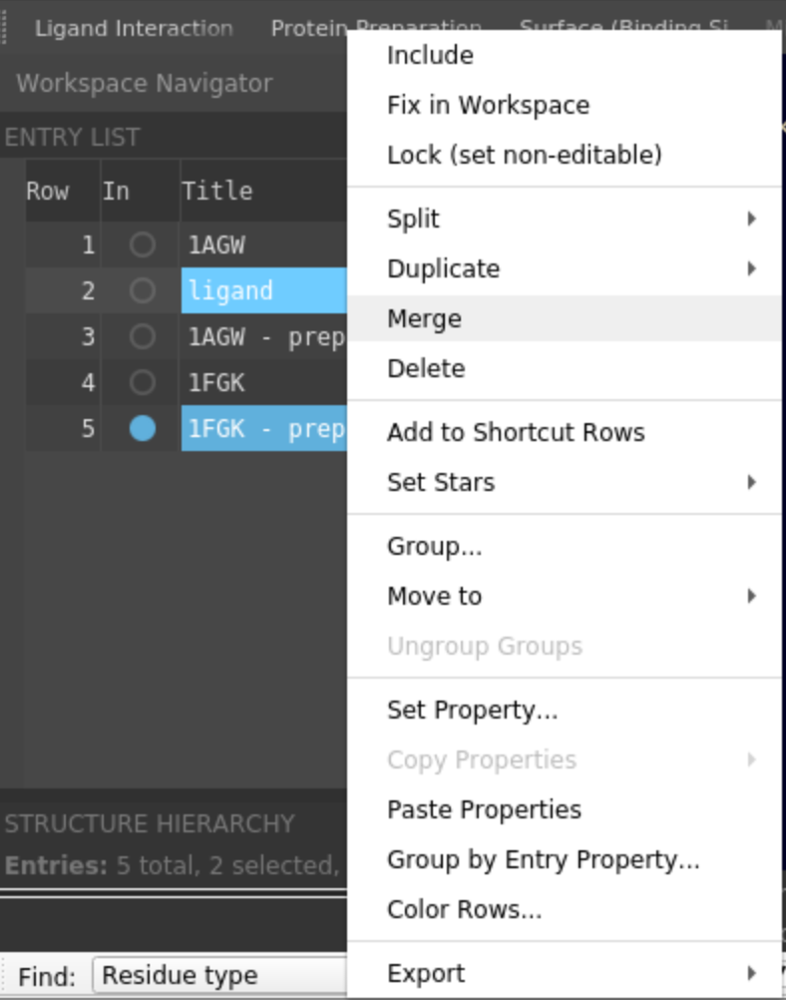
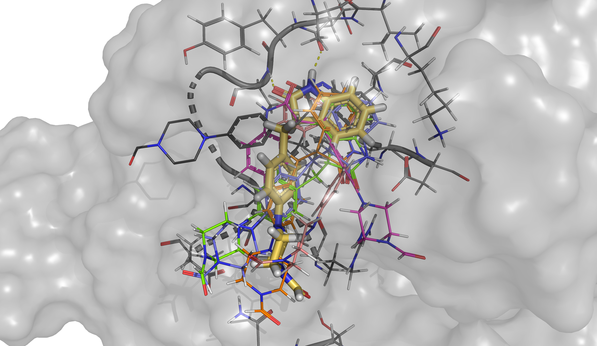

Elucidating ligand's binding path
==================================

In this tutorial we will use the **OutIn package** to predict the binding path of an inhibitor of tyrosine kinase domain of fibroblast growth factor receptor 1 (PDB 1AGW) using
an APO (PDB 1FGK) structure as a starting point.

1. Protein file
----------------

We will be using Schrödinger Maestro (release 2021-3) to preprocess a complex of interest from Protein Data Bank so
that it can be used by PELE (Protein Energy Landscape Exploration).

In general, PELE input files need to follow a few guidelines:

    * The protein needs to be correctly protonated.
    * The ligand must be in a separate, unique chain.
    * Ligand residue name cannot be ``UNK``.
    * We also recommend removing any solvents and crystallization artefacts.

a. **Download the protein structures** 1AGW (holo) and 1FGK (apo) by clicking on ``File -> Get PDB`` and inputting their respective codes. Once the download is complete, you should see both structures in the entry list on the left panel.

b. **Preprocess the holo structure**. Select entry 1AGW, click on ``Tasks`` and search ``Protein Preparation Wizard``. Check the following options and hit ``Preprocess``. When prompted about multiple occupancy issues, simply select all entries and ``Commit``.

If you do not have Prime installed, you can skip filling in missing loops and side chains, but we do recommend doing that.

c. **Extract the ligand**. Select the ligand, then click on the ``Build`` menu and copy it to a new entry. It should show up in the entry list on the left.

d. **Preprocess the apo structure**. Select entry 1FGK and remove all chains except for B, you can do that by selecting each chain and using the ``Delete selected atoms`` button in the ``Build`` menu. Preprocess remaining chain with ``Protein Preparation Wizard`` using the same options as before.

::

e. **Merge**. Select the preprocessed 1FGK and ligand entries, then right click and ``Merge`` into one entry. The ligand can be placed anywhere in the system, since PELE will automatically move it to the simulation box.

f. **Adjust ligand properties**
    * Select the ligand, open ``Build`` and choose ``Other edits -> Change atom properties...``
    * Set residue name to **LIG** and chain name to **Z**
    * Set residue number to **1**
    * Choose ``PDB atom name`` from the drop down list and select ``Set unique PDB atom names within residues``
    * Click ``Apply`` and close the window.

::

g. **Save** the merged entry as ``system.pdb`` in your working directory.

2. PELE configuration file
--------------------------

Create ``input.yaml`` file in your working directory, it should contain the following flags:

    - **system** - path to the protein-ligand PDB file
    - **chain** - ligand chain ID, here ``Z``
    - **resname** - ligand residue name, in our case ``LIG``
    - **out_in** - sets the defaults for the OutIn simulation
    - **atom_dist** - atom distances to track throughout the simulation
    - **initial_site** - residue corresponding to the starting point of the simulation, on the outside of the protein
    - **final_site** - end point of the simulation, where the ligand is supposed to bind
    - **epsilon** - strength of the bias applied, needs to be between 0 and 1, where 0 corresponds to no bias applied
    - **spawning** - type of spawning when running an adaptive simulation, here changing to "epsilon" to apply the bias
    - **bias_column** - column of the report (counting from 1) towards which the simulation should be biased
    - **constraint_level**: - level of constraining alpha carbons of the protein to prevent structure collapse
    - **cpus** - number of CPUs you want to use for the simulation (we suggest a minimum of 50 for a normal simulation, but you could lower it for training purposes only).

..  code-block:: yaml

    # General settings
    system: 'system.pdb'
    chain: 'Z'
    resname: 'LIG'
    out_in: true
    cpus: 60
    constraint_level: 3  # Not mandatory but it will apply higher constraints to the protein backbone
    seed: 12345

    # Structural specifications
    initial_site: "B:486:O"
    final_site: "B:562:O"  # Defines the final site near the hinge
    atom_dist:
        - "Z:1:H1"  # Distance used to lead the entrance of the ligand to the hinge
        - "B:562:O"
        - "Z:1:O1"
        - "B:564:H"

    # Add bias towards the first distance we defined
    spawning: "epsilon"
    epsilon: 0.5
    bias_column: 8

**We strongly recommend running a test first to ensure all your input files are valid.**
Simply include ``test: true`` in your input.yaml and launch the simulation, it will only use 5 CPUs. If it finishes correctly, you can remove the test
flag and start a full production run. Otherwise, inspect the logs and correct any mistakes indicated in the error codes.

3. Launching the simulation
---------------------------

Once you have ``system.pdb`` and ``input.yaml`` in your working directory, you can launch the simulation using one of the following methods:

    - **directly** on command line using ``python -m pele_platform.main input.yaml``

    - submit a slurm file to the **queue system** (ask your IT manager, if you are not sure how to do it). In our case, the slurm file is called ``run.sl`` and we can launch it on the command line using ``sbatch slurm.sl``

Example slurm file:

.. code-block:: console

    #!/bin/bash
    #SBATCH -J PELE
    #SBATCH --output=mpi_%j.out
    #SBATCH --error=mpi_%j.err
    #SBATCH --ntasks=50
    #SBATCH --mem-per-cpu=1000

    python -m pele_platform.main input.yaml

4. Analysis of the results
--------------------------

a. Plots
++++++++

The ``plots`` directory contains several plots to help you get the general idea of the progress of the simulation, showing relationships between
the binding energy and solvent accessible surface area of the ligand, distance between two selected atoms or any other metric of your choice.

For example, if we open the plot called ``distance1.5_Binding_Energy_plot.png``, we will be able to see the binding energy of each
accepted pose during the simulation with respect to the first distance that was specified in the input.yaml. The distance we
defined was between atoms ``H1`` of the ligand and ``O`` of residue 562, hence, the hinge interaction. From the values of the plot
we can see how the ligand could have access the binding site from an outer position.

.. image:: ../img/out_in_plot.png
  :width: 400
  :align: center

b. Top poses
++++++++++++++++++

PELE also scans all produced poses and retrieves the top 100 lowest binding energy structures to the ``top_poses`` folder. The file names indicate
the trajectory and model IDs of each structure as well as its associated binding energy. According to the previous plot, some of the structures
with low binding energy values will satisfy the hinge interaction.

We can visualize the structure with the lowest binding energy and check the pose of the ligand. We can see how the hinge interaction
is preserved. On the other hand, the branch with the piperazine ring is not matching with the crystallographic pose (represented in dark
grey) since PELE found an extra interaction between the final aldehyde group and the protein. However, if our goal is to reproduce the binding mode
of this ligand, it is recommended to start an induced fit docking simulation from this final pose that is already inserted in the binding site.

.. image:: ../img/out_in_best_pose.png
  :width: 400
  :align: center

c. Clusters
+++++++++++

Although ``plots`` and ``top_poses`` give important information to known if the hinge interaction could be achieved, the data
inside ``clusters`` is usually very helpful since it shows the most important binding modes obtained through the simulation.
Inside this folder we find a representative structure of each cluster and the energetic profiles of PELE colored by the clusters
that have been obtained. Thus, it is easy to identify those clusters associated with lower binding energies that might look
more interesting.

For instance, we can see that cluster D (purple points in the plot and yellow pose in the structure) is the cluster that has the
lowest binding energy and it keeps the same interaction as seen in the best pose above. Besides, black crosses locate the points
that were taken as representative structures in each case.

.. image:: ../img/out_in_cluster_plot.png
  :width: 400
  :align: center

