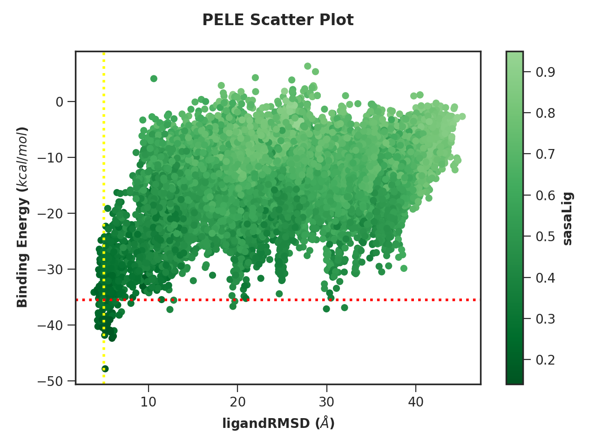

.. _PlotterTutorial:

Creating custom plots with PELE Plotter
=============================================

Prerequisites
--------------
Before attempting this tutorial you should install PELE Platform (version 1.6 or higher) and activate the Python environment you normally use
to run it. You can run the following command to check if everything is working correctly - it should print a list
of all available arguments.

.. code-block:: console

    python -m pele_platform.plotter -h

Simple plots
-------------

**1. Select data source**

The data can come from multiple sources, so feel free to choose any of the following:

    - the **CSV file** generated during the simulation. It is located in ``working_directory/results/data.csv``.
    - path to the **output** folder of PELE. Usually it is found in ``working_directory/output`` and it is the folder that contains the epochs with their report and trajectory files.
    - path to the **results** folder where the CSV file is stored. It is located in ``working_directory/results``.

Please, mind that each data source requires a use of different command line argument:

.. code-block:: console

    python -m pele_platform.plotter -o /home/LIG_Pele/output/ ...
    python -m pele_platform.plotter -r /home/LIG_Pele/results/ ...
    python -m pele_platform.plotter -c /home/LIG_Pele/results/data.csv ...

**2. Select plot type**

The new Plotter offers four different plot types, each able to visualise up to three data columns (except for the density and histogram plots, which can only display two columns):

    - standard **scatter** plot
    - **density** plot, similar to scatter, but displaying kernel density estimates (KDE) on the axes.
    - **histogram** plot, similar to the density plot but showing histograms instead.
    - **interactive** which allows you to hover over data points to determine which trajectory they originate from.

You should set the plot type using ``-t`` argument, however, if you do not, it will default to the standard scatter plot.

**3. Choose metrics to plot**

You can plot any of the metrics appearing in your report files by pointing the Plotter to the right **column number**. As a minimum,
you will have to provide metrics for x- and y-axis, however, you can also set z-axis, which will colour the data points
according to that metric (this does not apply to the density or histogram plots).

If you are unsure which numbers correspond to each metric, you can simply set data source and plot type and hit "enter".
The tool will show you all available options and walk you through the setup.

Customization
---------------

Colour scheme
++++++++++++++++

Once you get the basics done, you can customize the colour scheme of your plot using the following arguments:

    - ``--color`` to change the colour of the data points, you can select one of the built-in options:

        .. hlist::
            :columns: 3

            * blue
            * red
            * green
            * purple
            * orange

    - ``--colormap`` to select the colour scheme for representing values on the Z-axis, choose one of:

        .. hlist::
            :columns: 3

            * plasma
            * magma
            * turbo
            * jet
            * gnuplot
            * gnuplot2
            * nipy_spectral
            * spectral
            * cividis
            * inferno
            * autumn
            * winter
            * spring
            * summer
            * wistia
            * copper
            * blues
            * reducedblues
            * reducedgreens
            * reducedreds
            * reducedpurples
            * reducedoranges

    - ``--background_color`` to customize the background of your figure. It must be a `CSS4 <https://www.w3.org/wiki/CSS/Properties/color/keywords>`_ compatible color name.

Custom lines
+++++++++++++

Draw custom **vertical and horizontal lines** to highlight relevant thresholds on your plot, using the following arguments:

    - ``--vertical_line n color``
    - ``--horizontal_line n color``

Where ``n`` is the point of intercept on the axis and ``color`` corresponds to the desired colour of the line.
It must be a `CSS4 <https://www.w3.org/wiki/CSS/Properties/color/keywords>`_ compatible color name.

Axis labels and title
++++++++++++++++++++++

Override the default **axis labels** by passing a string after the metric column number, e.g.

.. code-block:: console

    python -m pele_platform.plotter -o /home/LIG_Pele/output/ -t scatter -x 7" RMSD of the ligand" -y 5 ...

Moreover, to add a **custom title** to your figure, all you have to do is use ``--title`` argument and supply a string with your desired text.

Filters and ranges
+++++++++++++++++++

Apply custom **filters** to data points by setting specific thresholds for each column, it can be done by passing the following parameters to the ``--filter`` command line argument:

        - column number corresponding to the metric where the filter will be applied
        - character representing the condition to apply in the filtering, one of: ``<``, ``==``, ``>``, ``<=``, ``>=`` or ``lt``, ``eq``, ``gt``, ``le``, ``ge``
        - the cutoff value.

For example, to include only those values from column report 5, which are greater or equal 15, you'd do the following: ``--filter 5 >= 15``

You can also plot only the relevant data by setting **limits** to the scope of values plotted on each axis using the following flags:

    .. hlist::
        :columns: 3

        * ``--xlowest``
        * ``--xhighest``
        * ``--ylowest``
        * ``--yhighest``
        * ``--zlowest``
        * ``--zhighest``

Other
+++++++++

You can further customise the **density plot** by using:

    - ``--with_edges`` argument to visualise the distribution on the plot area
    - ``--n_bins`` to define the number of bins to display in the histogram plot, first element corresponds to the X axis and the second to the Y axis.  If only one value is provided, it will be applied to both axes.
    - ``--n_levels`` to adjust the number of levels shown on the plot area.

Finally, the Nostrum Biodiscovery **logo** can be hidden by using ``--hide_logo`` argument.

Saving to file
-----------------

If you want to save the plot **to a file** instead of displaying it, use the ``--save_to`` argument and supply a path to the file (this option does not apply to interactive plots).

Examples
----------

**Example 1.** Density plot of ligand RMSD versus binding energy

.. code-block:: console

    python -m pele_platform.plotter -o /home/LIG_Pele/output/ -t density -x 7 -y 5 --hide_logo

.. image:: ../img/plotter_example1.png
  :width: 400
  :align: center

**Example 2.** Scatter plot with custom colour scheme and lines

.. code-block:: console

    python -m pele_platform.plotter -o /home/LIG_Pele/output/ -t scatter -x 7 -y 5 -z 6 --colormap reducedgreens --vertical_line 5.0 yellow --horizontal_line -35.5 red --hide_logo

**Example 3.** Interactive plot with custom axis labels, ranges and colour scheme

.. code-block:: console

    python -m pele_platform.plotter -o /home/LIG_Pele/output/ -t interactive --xhighest 15 -x 7 "Ligand RMSD" -y 5 "Interaction energy" -z 6 "Solvent accessible surface area" --colormap wistia --background_color black --hide_logo

.. image:: ../img/plotter_example3.png
  :width: 400
  :align: center

**Example 4.** Density plot of ligand RMSD versus binding energy with orange data points as well as visualised edges (10 levels)

.. code-block:: console

    python -m pele_platform.plotter -o /home/LIG_Pele/output/ -t density --with_edges --n_levels 10 --color orange --hide_logo --title "Density plot with edges" -x 7 -y 5 -z 6

.. image:: ../img/plotter_example4.png
  :width: 400
  :align: center
