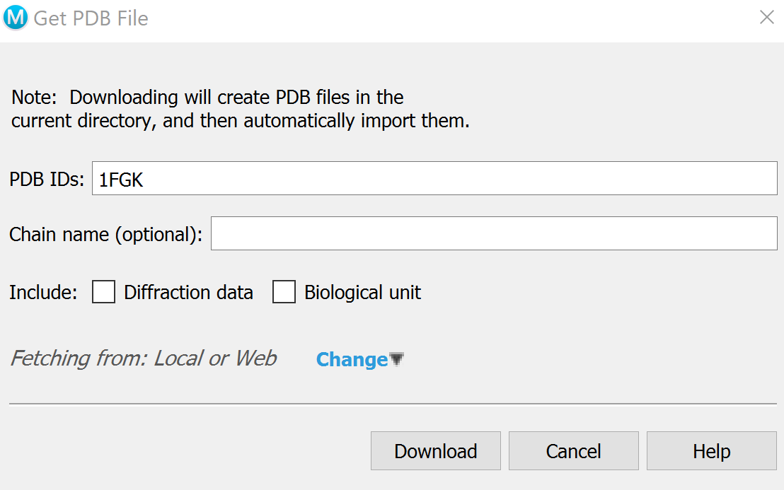
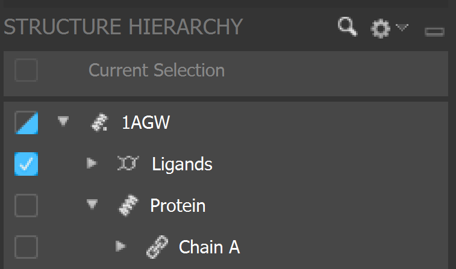
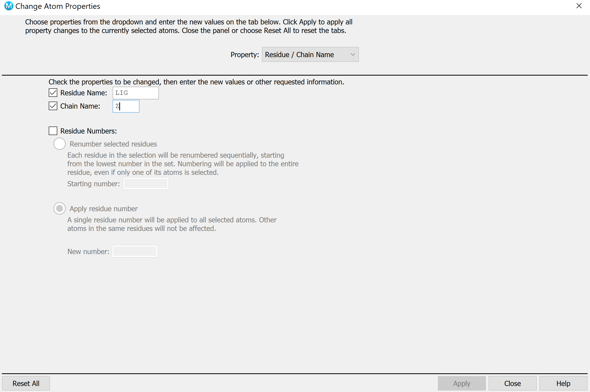
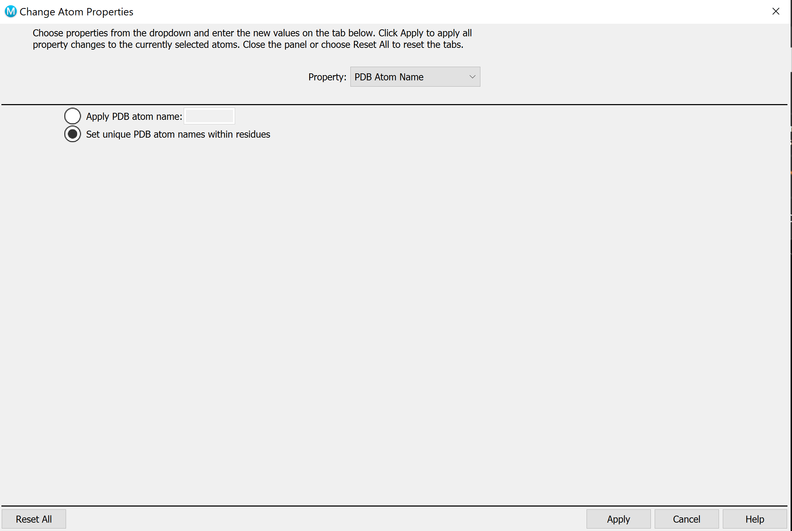
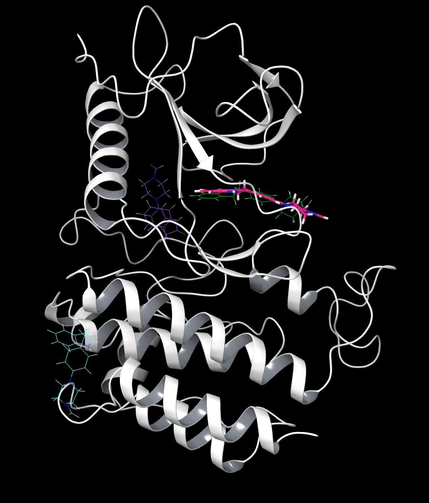

Site finder tutorial
=====================
The goal of the Site Finder package is to locate and predict the best binding site for a ligand. We will be comparing the results to the crystal structure by calculating the RMSD difference at every step, however, this is not required to run site finder in general.

1. System Preparation
++++++++++++++++++++++++++
We will be using Schrödinger Maestro (release 2020-1) to preprocess a complex of interest from Protein Data Bank so that it can be used by PELE (Protein Energy Landscape Exploration).

a. Download structures 1FGK without ligand (*apo*) and 1AGW with the ligand (*holo*) by going to ``File -> Get PDB`` and inputting their respective codes.

b. Align the structures by going to ``Tasks -> Protein Structure Alignment`` and delete redundant side chains by going to the ``Structure Hierarchy -> File Name -> Protein`` and selecting unnecessary chains and deleting them until only chain A is left.

c. For both holo and apo, locate which solvents and metals/ions are important to the function of the protein. These will be close to the ligand and fully inside the protein structure. Highlight all solvents with the solvent key and deselect the solvents of importance, and delete the others. Hand select metals/ions to delete.

.. figure:: ../img/site_finder_1.3_2.png
  :width: 400
  :align: center

  At this point your holo should look like this; here the protein ribbons, solvents and metal are highlighted. Apo should be the same without the ligand (shown here in pink).

d. For both *holo* and *apo*, select a molecule and go to ``Build -> Other edits -> Change Atom Properties`` and set unique PDB atom names. On *holo*, select the ligand and change the residue name to *LIG*, chain name to *Z*.

e. Preprocess both structures using the Protein Preparation Wizard. You may need to optimize H-bonds in the Refine tab. Follow the instructions until no more problems are reported.

.. image:: ../img/site_finder_1.5.1.png
  :width: 400
  :align: center

.. image:: ../img/site_finder_1.5.2.png
  :width: 400
  :align: center

f. Copy the ligand from *holo* and paste it into *apo*, and move it to the side of the structure. You may need to go to ``Build -> Move`` to move it out of the way.

.. figure:: ../img/site_finder_1.6_2.png
  :width: 400
  :align: center

  At this point your apo should look like this.

g. You can now export the files by going to ``File -> Export Structures`` and name them respectively *holo.pdb* and *apo.pdb* and they are ready to use.

2. PELE input file
+++++++++++++++++++

Create an ``input.yaml`` file in your working directory.

..  code-block:: yaml

	system: apo.pdb
	chain: Z
	resname: LIG
	site_finder: true
	rmsd_pdb: holo.pdb
	cpus: 50
	seed: 12345

3. Running the simulation
++++++++++++++++++++++++++

Create a ``run.sl`` file in your working directory. You can download ready slurm files for :download:`MareNostrum<../files/slurm_mn.sh>` and the :download:`NBD cluster <../files/slurm_nbd.sh>`. If you are running the simulation on the NBD cluster, you have to include ``usesrun: true`` in your input.yaml!

Once you have your ``apo.pdb``, ``holo.pdb``, ``input.yaml``, and ``run.sl`` files in your working directory you are ready to launch your simulation with the command ``sbatch run.sl``!

4. Analysis
++++++++++++++

Navigate to the results directory ``LIG_Pele -> 2_refinement_simulation -> results``, which contains several output folders: .

* *Clusters* folder contains information about final ligand clustering: it shows how many clusters were obtained (0-8, labeled A-H), provides a CSV file with collective data as well as some plots.

* Binding energy plots show you what has the lowest binding energy; typically those with the lowest binding energy are the best fit (but not always). RMSD plots show the correlation between the ligand position found and the ligand position of the reference (native pose).

* *Top_poses* shows the top 100 poses with the lowest binding energy. Poses are named with the distance at the beginning and binding energy at the end. Ideally, you want the binding energy to be low and the RMSD to be close to 1.

A simulation is successful if one of the predicted positions matches the holo position. These can be shown by opening the cluster poses and displaying the ligands. Here we have compared clusters B (blue), E (purple), and G (green) to the original ligand (pink) in the protein. B shows the least accurate placement, and while E is closer, it is still incorrect. G is very similar and the best pose.

An important place to look to display these characteristics is the ``ligandRMSD_Binding_Energy`` plot. You can see exactly how correlated each structure and cluster are and how likely they are to occur naturally. In this example it can be seen that clusters C, D, and G all have very similar low binding energies, but G has the lowest RMSD, and is therefore the best fit. This confirms what the visual representation above predicted.

.. image:: ../img/site_finder_2.2.png
  :width: 400
  :align: center

This is a closer look at the holo ligand and the ligand from G. Here you can see that the original ligand and predicted ligand take almost the exact same position. This is because they are both stabilized by the same Hydrogen bonds (shown in yellow).

.. image:: ../img/site_finder_2.4.png
  :width: 400
  :align: center

Two more important plots are ``top_clusters_ligandRMSD_boxplot`` and ``top_clusters_Binding_Energy_boxplot`` (shown respectively below). From the first plot, it can be seen that cluster G has the lowest RMSD, and is therefore the most correlated with the original holo ligand. This confirms what we have seen above. The second shows that C, D, and G forms have a similar binding energy level so they are almost equally likely to occur. This is important because it means that our predicted best fit is likely to occur naturally.

.. image:: ../img/site_finder_2.5.png
  :width: 400
  :align: center

.. image:: ../img/site_finder_2.6.png
  :width: 400
  :align: center
